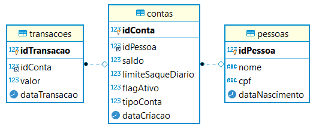
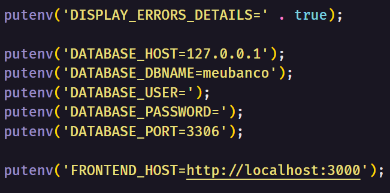
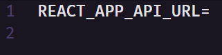
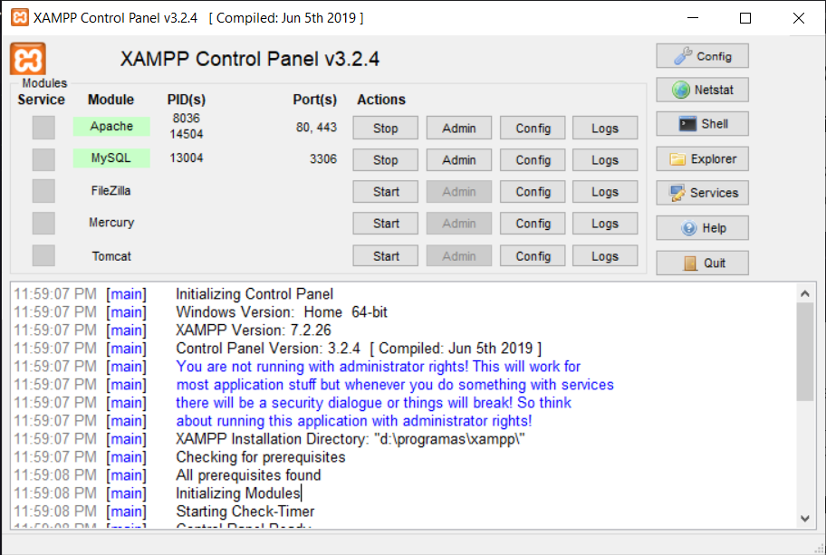
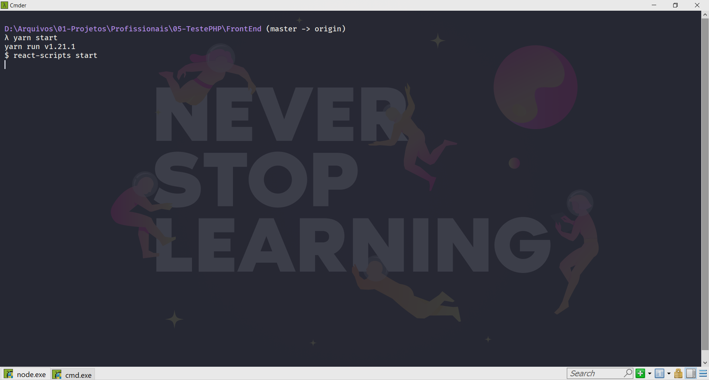
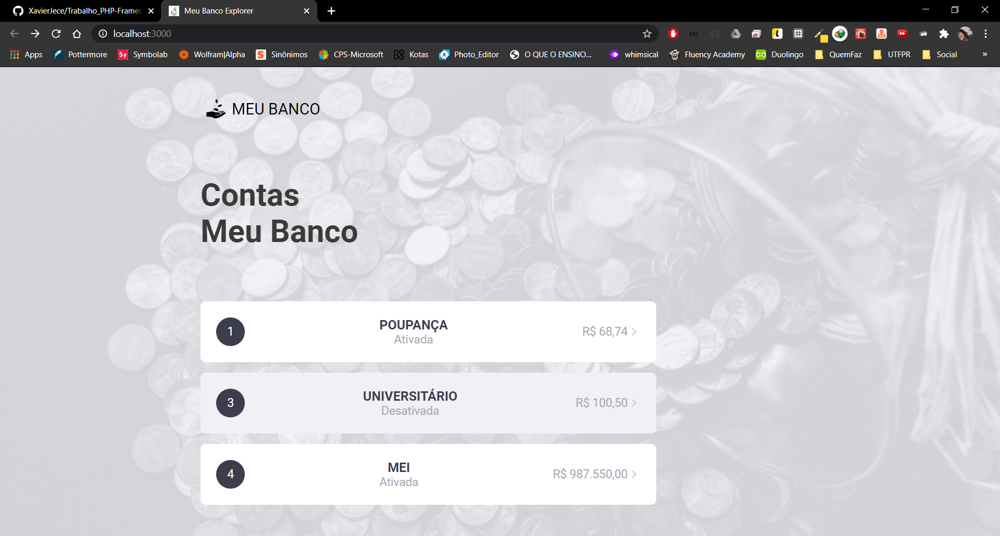
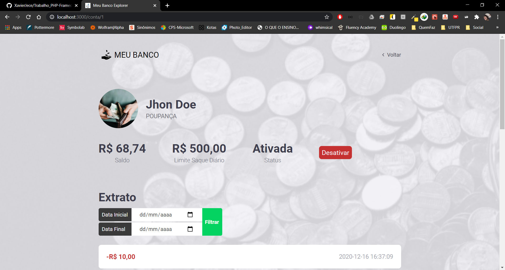
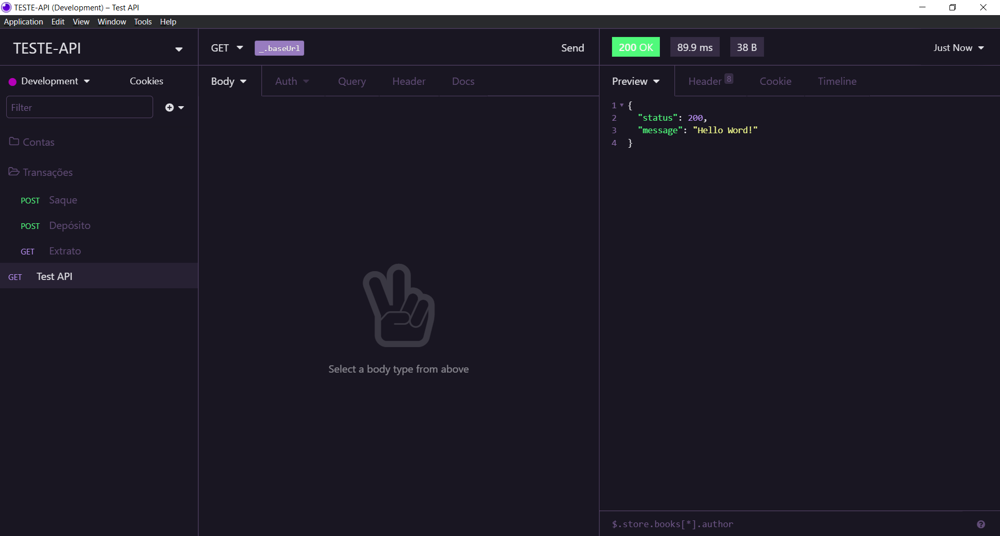
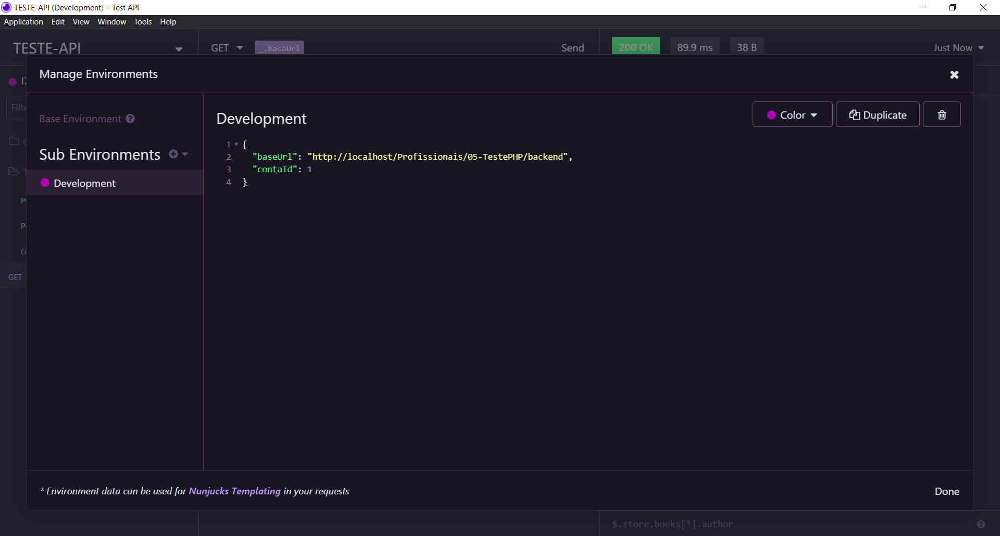

# Manual de Execução

O projeto foi com as tecnologias: 

* PHP 7.2 com o Slim Framework 3 para a criação da API;
* ReactJS para fazer as telas de interação;
* MYSQL para o banco de dados.

## Requisitos

* [Composer](https://getcomposer.org/)
* [NodeJS](https://nodejs.org/en/)
* Servidor APACHE e MYSQL
  * [XAMPP](https://www.apachefriends.org/pt_br/index.html)
  * [WAMPSERVER](https://www.wampserver.com/en/)

## Iniciando Projeto

### Clone da Aplicação

SSH: ``` git clone git@github.com:XavierJece/Trabalho_PHP-Frameork.git ```

HTTP: ``` git clone https://github.com/XavierJece/Trabalho_PHP-Frameork.git ```

**OBS:** O projeto deve ser clonado dentro da pasta que é executado seu servidor APACHE.

### Criação do Banco de Dados

Na pasta *extras* tem o ``` meubanco.sql ``` execute em seu database administrators para criar criar a estrutura do banco.

<center style="max-width: 900px; margin: auto;">

  
  DER do Banco de Dados

</center>

## Configuração

### Back-End

#### Definindo Variáveis de Ambiente

Dentro da *backend* copie o arquivo ``` env.example.php ``` para `` env.php `` atualize as informações de acordo com o seu ambiente.

<center style="max-width: 900px; margin: auto;">

  
  Variáveis de Ambiente do Back-End

</center>

**OBS:** ``` FRONTEND_HOST ``` é a rota que a interface estará sendo executada.

#### Instalação Dependências

Dentro da pasta ``` backend ``` executar o comando ``` composer install ``` ou ``` php composer.phar install ```

### Front-End

#### Definindo Variáveis de Ambiente

Dentro da *frontEnd* copie o arquivo ``` .env-exemplo ``` para `` .env `` atualize as informações de acordo com o seu ambiente.

<center style="max-width: 900px; margin: auto;">

  
  Variáveis de Ambiente do Front-End

</center>

**OBS:** A url deve ser a basta do seu backend.
**Exemplo:** REACT_APP_API_URL=http://localhost/Profissionais/05-TestePHP/backend 

#### Instalação Dependências

Dentro da pasta ``` frontEnd ``` executar o comando ``` npm install ``` ou ``` yarn ```

## Execução

### Back-End

Para iniciar o backend basta iniciar o serviço do APACHE e MYSQL.

<center style="max-width: 900px; margin: auto;">

  
  Exemplo com o XAMPP

</center>

### Front-End

Dentro da pasta *frontEnd* executar o comando ``` npm start ``` ou ``` yarn start ```

Caso a porta 3000 estiver live já inicializará o server em http://localhost:3000 caso esteja ocupada será usada a proxima porta disponível.

<center style="max-width: 900px; margin: auto;">

  
  Iniciando com YARN

</center>

## Teste

### Paginas

A interface é composta por duas telas (rotas): 

* **/** Onde é a listagem das contas cadastradas no banco de dados.
* **conta/{idConta}** Onde é listado as informações da conta e seu extrato.

<center style="max-width: 900px; margin: auto; display: flex;">

  <div style="margin-right: 4px;">

  
  Pagina de listagem de contas.

  </div>

  <div style="margin-left: 4px;">

  
  Pagina de visualização de conta.

  </div>

</center>

### Rotas da API

A API tem as seguintes rotas:

* *GET* **/** Teste de Server.
  * Returns
    * 200
    ```
      {
        "status": 200,
        "message": "Hello Word!"
      }
    ```
    * 400
    ```
      {
        "status": "error",
        "message": string
      }
    ```
* *POST* **/conta** Criar Conta.
  * Parameters
    * *body*
    ```
      {
        "idPessoa": int, 
        "tipoConta": "MEI" | "POUPANÇA" | "UNIVERSITÁRIO" "CORRENTE",
        "limiteSaqueDiario": float
      }	
    ```
  * Returns
    * 200
    ```
      {
        "idConta": int,
        "idPessoa": int,
        "saldo": float,
        "limiteSaqueDiario": float,
        "flagAtivo": boolean,
        "tipoConta": "25" | "13" | "17" | "10",
        "dataCriacao": string
      }
    ```
    * 400
    ```
      {
        "status": "error",
        "message": string
      }
    ```
* *GET* **/conta** Listar Todas Contas.
  * Returns
    * 200
    ```
      Array de: 
      {
        "idConta": int,
        "idPessoa": int,
        "saldo": float,
        "limiteSaqueDiario": float,
        "flagAtivo": "1" | "0",
        "tipoConta": "25" | "13" | "17" | "10",
        "dataCriacao": string
      }
    ```
    * 400
    ```
      {
        "status": "error",
        "message": string
      }
    ```
* *GET* **/conta/{idConta}** VER Conta.
  * Parameters
    * *params*
    ```
      {
        "idConta": int
      }	
    ```
  * Returns
    * 200
    ```
      {
        "idConta": int,
        "idPessoa": int,
        "saldo": float,
        "limiteSaqueDiario": float,
        "flagAtivo": boolean,
        "tipoConta": "25" | "13" | "17" | "10",
        "dataCriacao": string,
        "pessoa": {
          "idPessoa": int,
          "nome": string,
          "cpf": string,
          "dataNascimento": string,
        }
      }
    ```
    * 400
    ```
      {
        "status": "error",
        "message": string
      }
    ```
* *PATCH* **/conta/{idConta}/ativar** Ativar Conta.
  * Parameters
    * *params*
    ```
      {
        "idConta": int
      }	
    ```
  * Returns
    * 200
    ```
      {
        "status": "success",
        "message": string
      }
    ```
    * 400
    ```
      {
        "status": "error",
        "message": string
      }
    ```
* *PATCH* **/conta/{idConta}/desativar** Desativar Conta.
  * Parameters
    * *params*
    ```
      {
        "idConta": int
      }	
    ```
  * Returns
    * 200
    ```
      {
        "status": "success",
        "message": string
      }
    ```
    * 400
    ```
      {
        "status": "error",
        "message": string
      }
    ```
* *POST* **/conta/{idConta}/deposito** Depositar Valor.
  * Parameters
    * *body*
    ```
      {
        "valor  ": float
      }	
    ```
  * Returns
    * 200
    ```
      {
        "status": "success",
        "message": string
      }
    ```
    * 400
    ```
      {
        "status": "error",
        "message": string
      }
    ```
* *POST* **/conta/{idConta}/saque** Sacar Valor.
  * Parameters
    * *body*
    ```
      {
        "valor  ": float
      }	
    ```
  * Returns
    * 200
    ```
      {
        "status": "success",
        "message": string
      }
    ```
    * 400
    ```
      {
        "status": "error",
        "message": string
      }
    ```
* *GET* **/conta/{idConta}/transacoes** Ver Extrato.
  * Description
    * Quando não tenha nunca *query params* o extrato é completo caso tenha ele filtra pelo período passado.
  * Parameters
    * *params*
    ```
      {
        "idConta": int
      }	
    ```
    * *query*
    ```
      {
        "dateInitial": string | null;
        "dateFinal": string | null;
      }	
    ```
  * Returns
    * 200
    ```
      Array de: 
      {
        "idConta": int,
        "idPessoa": int,
        "saldo": float,
        "limiteSaqueDiario": float,
        "flagAtivo": "1" | "0",
        "tipoConta": "25" | "13" | "17" | "10",
        "dataCriacao": string
      }
    ```
    * 400
    ```
      {
        "status": "error",
        "message": string
      }
    ```

#### Configuração do Insomnia

Para testar todas as Rotas pode ser usado programas que fazem as requisições *http*:
  
* [Insomnia](https://insomnia.rest/download/)
* [Postman](https://www.postman.com/downloads/)

Caso use o **Insomnia** dentro da pasta *extra* tem um arquivo ``` rotas.json ``` que não as configurações de todas as rotas para teste, já está com algumas varias configuração também que pode fazer alteração usando o ``` Ctrl + E ```.

<center style="max-width: 900px; margin: auto; display: flex;">

  <div style="margin-right: 4px;">

  
  Visualização do Insomnia.

  </div>

  <div style="margin-left: 4px;">

  
  Insomnia - Variáveis de Ambiente

  </div>

</center>

## Agradecimentos

Quero agradecer a oportunidade de estar participando do desafio, adorei todo que aprendi e espero ter conseguido atingir todos os requisitos.

Estou ansioso para o feedback de vocês, não vejo a hora de saber onde posso evoluir.

## Contato

**E-mail**: jece@alunos.utfpr.edu.br
